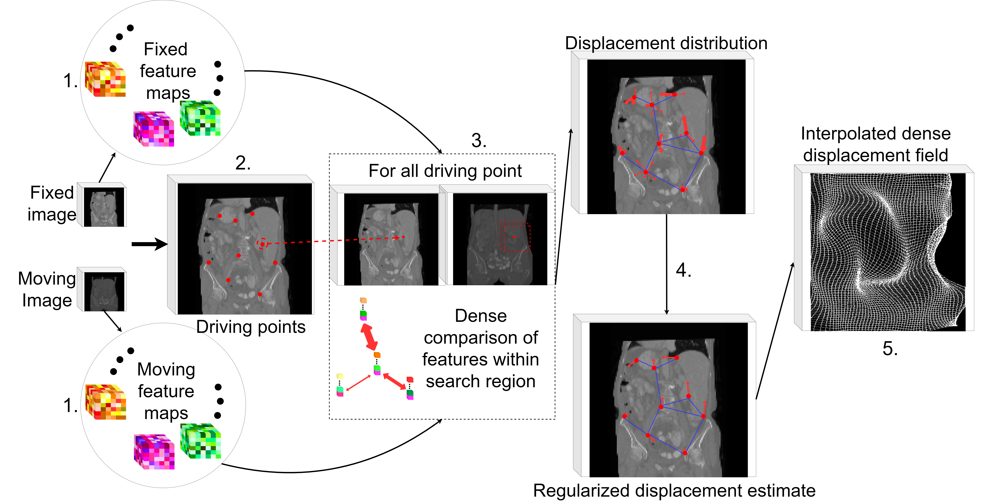
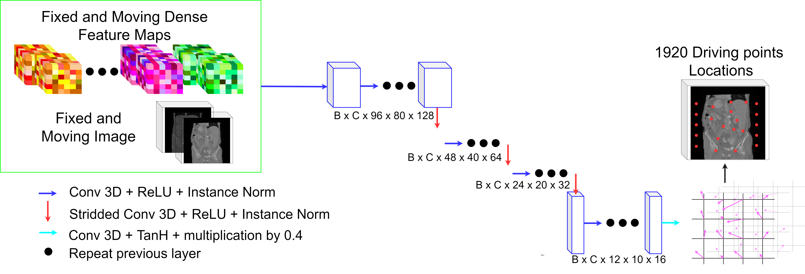

# Driving Points prediction

Code used for the experiments presented in (insert link). 

##  Overview

We proposed to learn a driving points predictor for probabilistic displacement medical image registration models which follow the typical pipeline:

Generic probabilistic displacement registration pipeline.1. Dense Feature Extraction: Dense feature maps are extracted from both the moving and the fixed image.2. Driving Points Identification: A subset of points from the fixed image are identified as driving points.3. Displacement Distribution Estimation: A displacement distribution is obtained for each driving points by comparing its associated feature vector with and feature vectors from the moving feature maps within a predefined search region.4. Regularization: a graph connecting the driving points is used to estimate a regularized displacement field.5. Interpolation: the displacement field is interpolated to the original voxel grid.

The proposed driving points predictor has the following architecture:

The driving points predictor takes as input the concatenation of both the fixed and the moving image as well as their associated dense feature maps. Hence, the driving points predictor can exploit the specific feature maps landscape to predict relevant points to match. The input tensor goes through an encoder network with several downsampling layers to obtain a lower resolution embedding of the input tensor. From there, a structured output is obtained by deforming a low-resolution regular grid i.e. the final layer of the driving points
predictor is also convolutional and predicts a displacement field to be applied to the low-resolution regular grid. The vertices of the deformed low-resolution grid are considered as driving points.

## Aknowledgements

Some part of the code base comes from https://github.com/multimodallearning/pdd_net and https://github.com/multimodallearning/graphregnet. 